# GreenSync - Eco-Friendly Smartwatch Landing Page

## Introduction
The **GreenSync** landing page is designed to showcase the innovative and eco-friendly smartwatch, GreenSync. This page combines aesthetics with functionality, providing users with a comprehensive and engaging experience as they learn about the smartwatch.

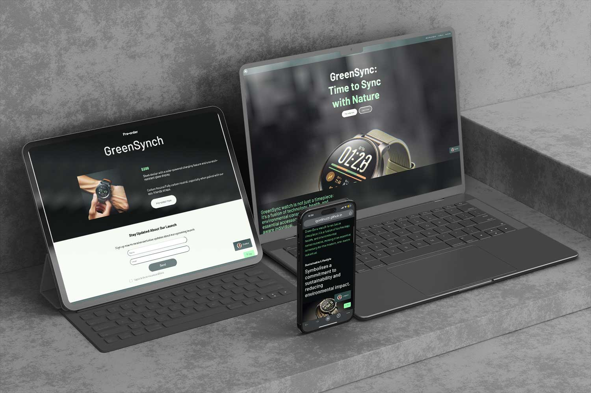

## Features of the Landing Page
- **Responsive Design**: Optimized for a seamless experience on desktops, tablets, and mobile devices.
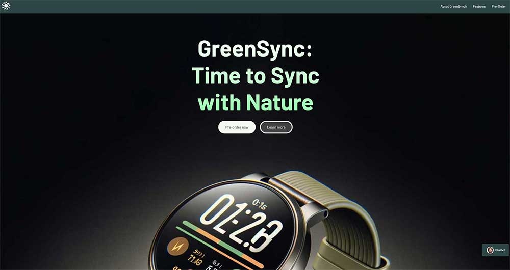
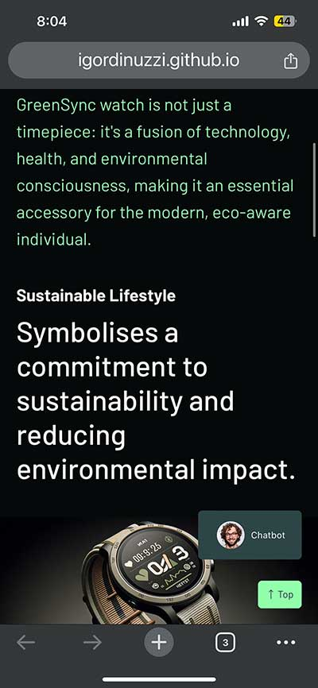
- **Interactive Chatbot**: Provides immediate assistance and answers to common queries.

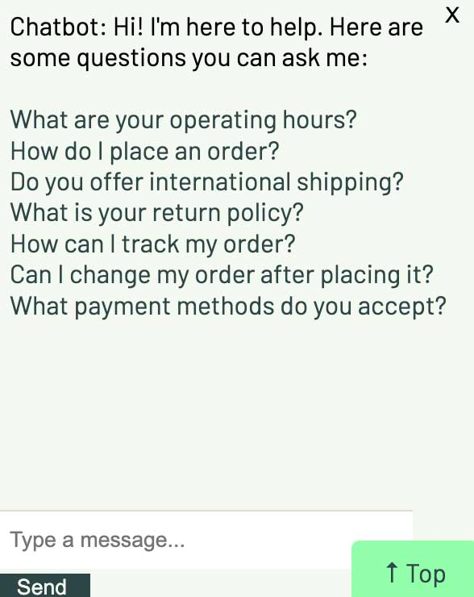
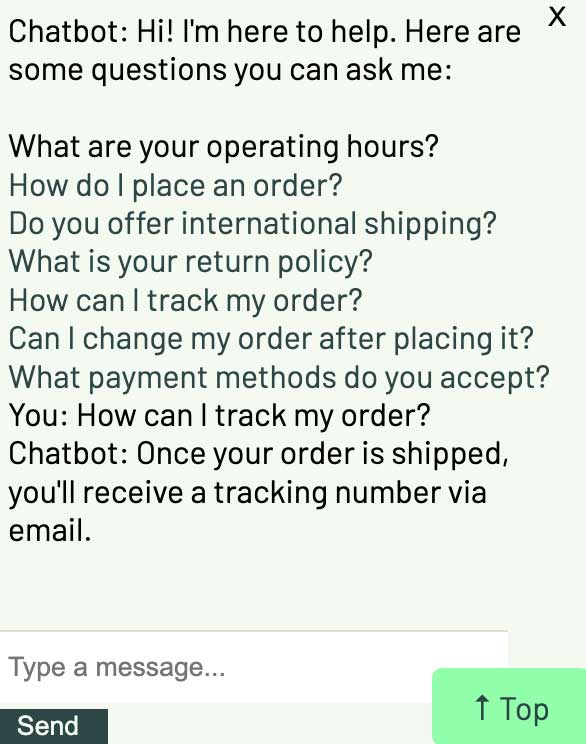
- **Dynamic Countdown Timer**: Builds anticipation by counting down to the product launch.
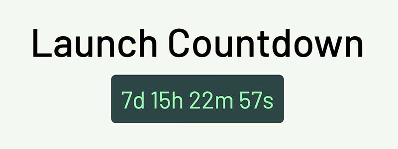
- **Gallery Section**: Showcases the smartwatch through various images and scenarios.

- **Pre-Order Section**: Allows visitors to pre-order the GreenSync smartwatch.
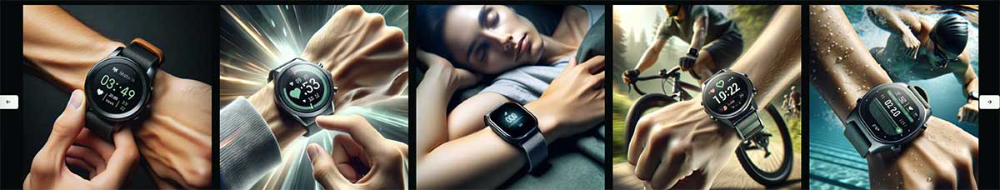
- **Accordion Feature for Details**: Organizes information about the smartwatch in a compact, easy-to-navigate format.
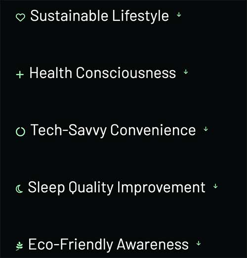
- **Smooth Scroll and Navigation**: Enhances user experience with easy navigation throughout the page.
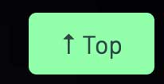
- **Newsletter Subscription**: Enables visitors to sign up for updates about the launch and other news.
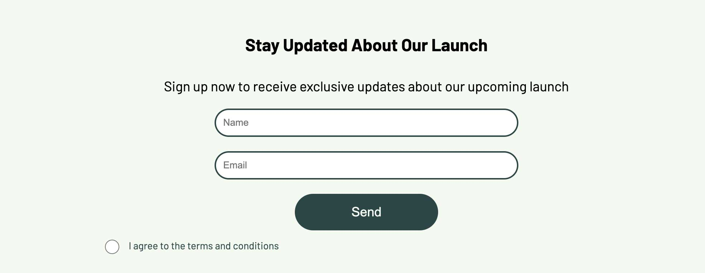
- **Contact Information and Social Media Links**: Offers easy access to further information and engagement.

- **Custom Favicon**: A unique favicon representing the GreenSync brand enhances brand recognition and user experience.

## Technology
- HTML/CSS for structure and styling, ensuring a responsive and visually appealing layout.
- JavaScript for interactive elements such as the chatbot, countdown timer, and accordion functionality, enhancing the user experience with dynamic content and interactions.

# How to Interact with the Page
- Explore Sections: Navigate through various sections like 'About', 'Features', and 'Pre-Order'.
- Chatbot Interaction: Utilize the chatbot for quick information and FAQs.
- Engage with the Countdown: View the countdown to the product launch.
- Browse the Gallery: Swipe through images showcasing the smartwatch.
- Pre-Order: Access the pre-order option available on the page.
- Newsletter Sign-Up: Stay updated by signing up for the newsletter.
- Social Media Engagement: Follow the provided social media links for more interaction.

# Installation
Clone the repository:
bash
Copy code
git clone https://github.com/igordinuzzi/greensynch.git
- Navigate to the cloned directory.
- Open index.html in a web browser to view the landing page.

# User Interaction
- Pre-Ordering: Users can express their interest in the smartwatch through the pre-order section.
- Gallery Navigation: Interactive gallery to explore the smartwatch's design and features.
- Chatbot Queries: Engage with the chatbot for instant information.

## Functionalities

#Chatbot
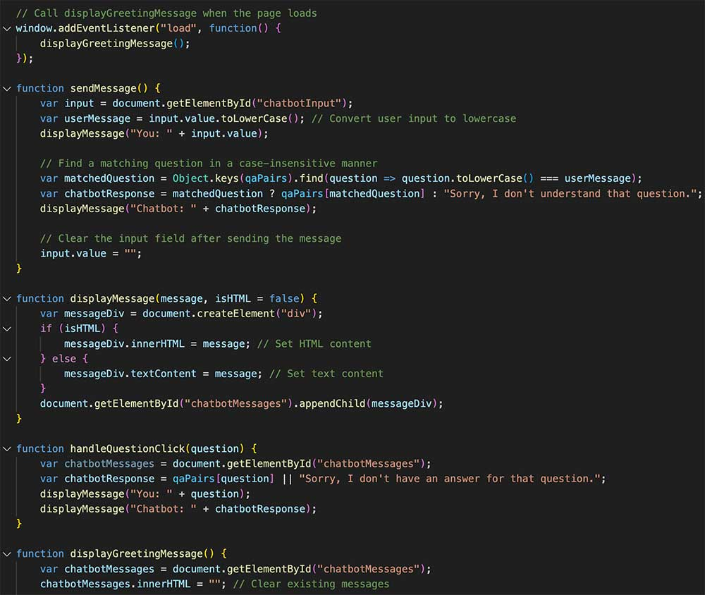

#Back to top
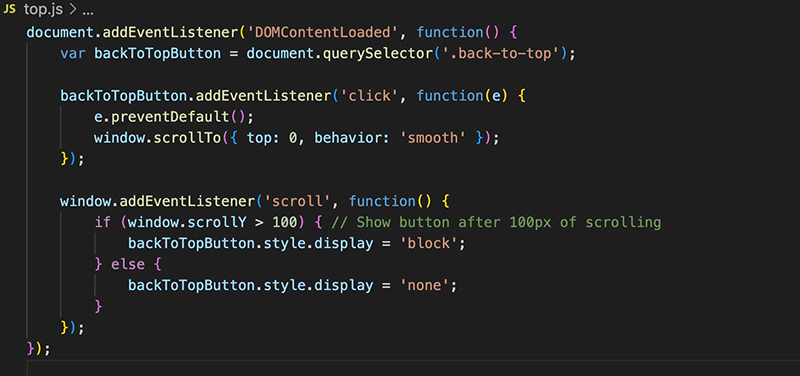

#Countdown
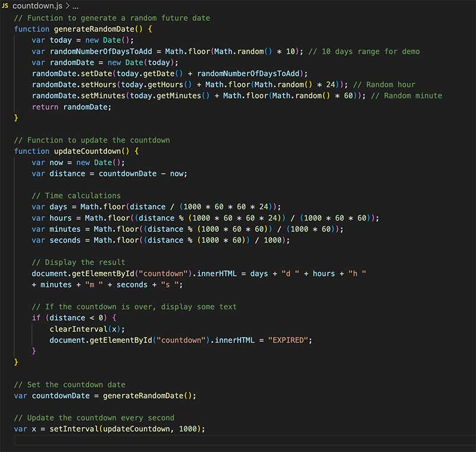

## Wireframes
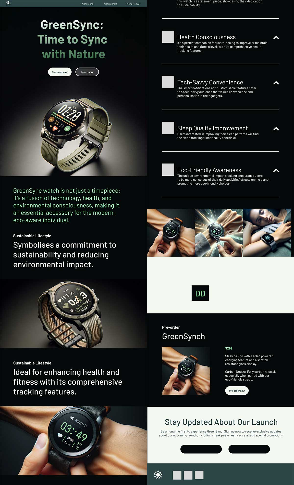

## User Stories

Story 1: Eco-conscious Consumer
As an environmentally aware individual, I want a landing page that emphasizes the eco-friendly aspects of the product, so that I can feel good about my purchase aligning with my values.

Story 2: Tech Enthusiast
As a tech enthusiast, I'm interested in the latest gadgets. I want a landing page that highlights the advanced features and specifications of the GreenSync smartwatch, so I can evaluate its technological prowess.

Story 3: Busy Professional
As a busy professional, I need a quick and efficient way to understand the product and its benefits. The landing page should allow me to grasp the key features quickly and provide an easy pre-order process.

## Usability Testing Report
Overview
Usability testing was conducted with five fictitious participants to assess the user experience and interface design of the GreenSync landing page.

# Participants
- Emma (Environmentalist): Looked for eco-friendly features and sustainable aspects.
- Liam (Tech Geek): Focused on technical specifications and smartwatch functionalities.
- Olivia (Busy Professional): Valued quick access to information and efficiency.
- Noah (Fashion Enthusiast): Interested in the design and aesthetics of the smartwatch and the website.
- Ava (Health Conscious User): Sought information on health and fitness tracking features.

# Findings and Observations
Emma loved the emphasis on sustainability but suggested highlighting renewable energy aspects.
Liam appreciated the detailed tech specs but recommended more interactive elements.
Olivia praised the clear layout but wanted a more streamlined pre-order process.
Noah enjoyed the visual appeal but suggested more images showcasing the watch's style.
Ava found the health features well-presented but wanted more details on app integration.

# Recommendations
Enhance the focus on renewable energy features for eco-conscious users.
Incorporate more interactive elements for tech-savvy users.
Streamline the pre-order process for efficiency.
Include additional images showcasing the watch's style and design.
Provide detailed information on health features and app integration.

## Validations

## Credits
- **Design**: Igor Dinuzzi
- **Logo**: Igor Dinuzzi
- **Content**: ChatGPT
- **Icons**: FontAwesome
- **Images**: DALL-E
- **Favicon**: Custom design for GreenSync

## Contributing
Contributions, issues, and feature requests are welcome. Feel free to check the issues page if you want to contribute.

## Contact

Project Link: [https://github.com/igordinuzzi/greensynch](https://github.com/igordinuzzi/greensynch)

Portfolio: [https://github.com/igordinuzzi](https://github.com/igordinuzzi)

