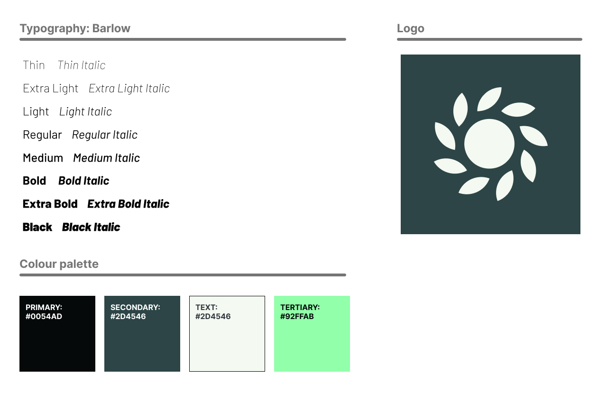
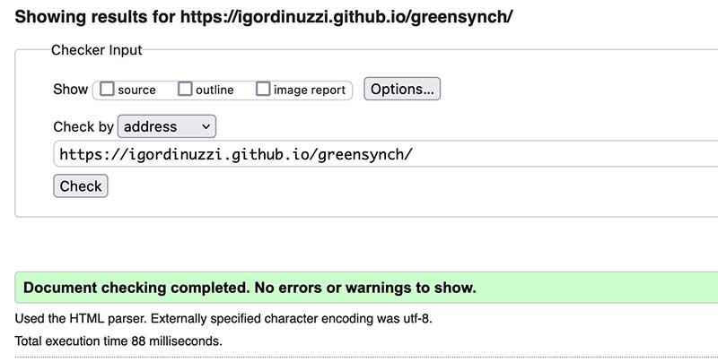
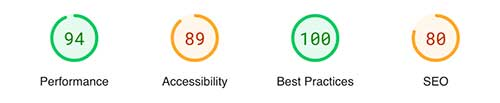
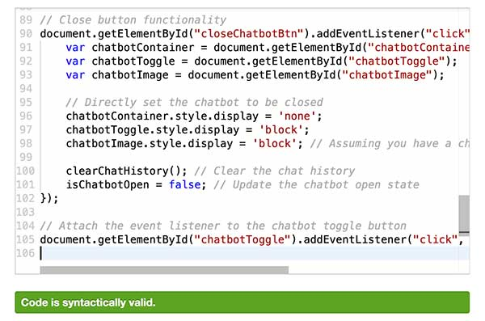
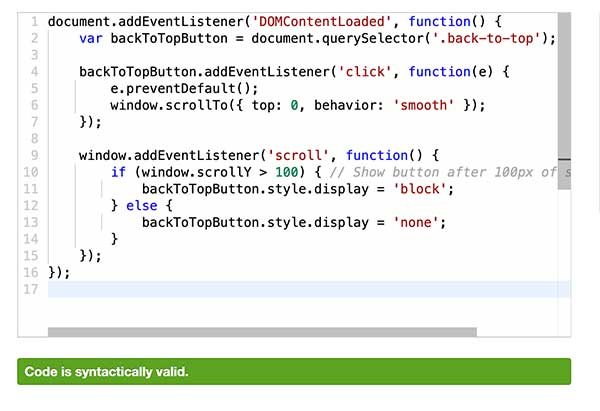
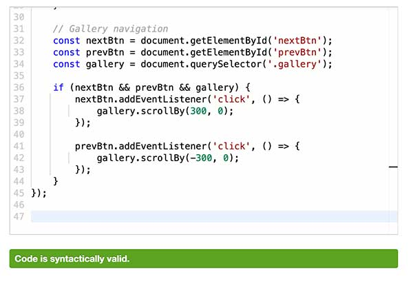
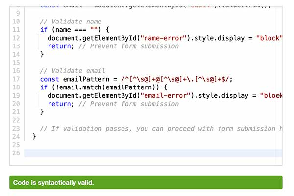
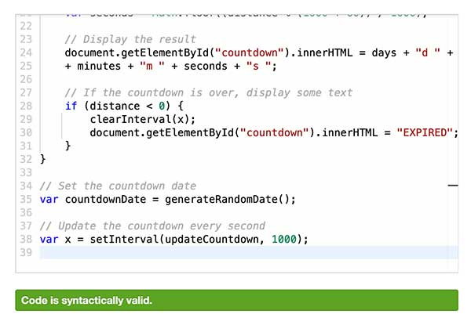

# GreenSync - Eco-Friendly Smartwatch Landing Page

## Introduction
The **GreenSync** landing page is designed to showcase the innovative and eco-friendly smartwatch, GreenSync. This page combines aesthetics with functionality, providing users with a comprehensive and engaging experience as they learn about the smartwatch.

## Features of the Landing Page
- **Responsive Design**: Optimized for a seamless experience on desktops, tablets, and mobile devices.

- **Interactive Chatbot**: Provides immediate assistance and answers to common queries.

- **Dynamic Countdown Timer**: Builds anticipation by counting down to the product launch.

- **Gallery Section**: Showcases the smartwatch through various images and scenarios.

- **Pre-Order Section**: Allows visitors to pre-order the GreenSync smartwatch.

- **Accordion Feature for Details**: Organizes information about the smartwatch in a compact, easy-to-navigate format.

- **Smooth Scroll and Navigation**: Enhances user experience with easy navigation throughout the page.

- **Newsletter Subscription**: Enables visitors to sign up for updates about the launch and other news.

- **Contact Information and Social Media Links**: Offers easy access to further information and engagement.

- **Custom Favicon**: A unique favicon representing the GreenSync brand enhances brand recognition and user experience.

## Technology
- HTML/CSS for structure and styling, ensuring a responsive and visually appealing layout.
- JavaScript for interactive elements such as the chatbot, countdown timer, and accordion functionality, enhancing the user experience with dynamic content and interactions.

# How to Interact with the Page
- Explore Sections: Navigate through various sections like 'About', 'Features', and 'Pre-Order'.
- Chatbot Interaction: Utilize the chatbot for quick information and FAQs.
- Engage with the Countdown: View the countdown to the product launch.
- Browse the Gallery: Swipe through images showcasing the smartwatch.
- Pre-Order: Access the pre-order option available on the page.
- Newsletter Sign-Up: Stay updated by signing up for the newsletter.
- Social Media Engagement: Follow the provided social media links for more interaction.

# Installation
Clone the repository:
bash
Copy code
git clone https://github.com/igordinuzzi/greensynch.git
- Navigate to the cloned directory.
- Open index.html in a web browser to view the landing page.

# User Interaction
- Pre-Ordering: Users can express their interest in the smartwatch through the pre-order section.
- Gallery Navigation: Interactive gallery to explore the smartwatch's design and features.
- Chatbot Queries: Engage with the chatbot for instant information.

## Functionalities

#Chatbot

#Back to top

#Countdown

## Wireframes

## User Stories

Story 1: Eco-conscious Consumer
As an environmentally aware individual, I want a landing page that emphasizes the eco-friendly aspects of the product, so that I can feel good about my purchase aligning with my values.

Story 2: Tech Enthusiast
As a tech enthusiast, I'm interested in the latest gadgets. I want a landing page that highlights the advanced features and specifications of the GreenSync smartwatch, so I can evaluate its technological prowess.

Story 3: Busy Professional
As a busy professional, I need a quick and efficient way to understand the product and its benefits. The landing page should allow me to grasp the key features quickly and provide an easy pre-order process.

### User Flow

1. **Landing on the Homepage**
   - User arrives at the homepage.
   - Views the hero section with the tagline "GreenSync: Time to Sync with Nature".

2. **Exploring Sections**
   - Scrolls through various sections: Introduction, About, Sustainable Lifestyle, Health Tracking, etc.
   - Interacts with the accordion in the Features section to learn more about specific features.

3. **Viewing the Gallery**
   - Browses through the image gallery showcasing the smartwatch in different scenarios.

4. **Learning About the Product**
   - Reads detailed descriptions about sustainability, health and wellness features.

5. **Pre-Ordering the Product**
   - Navigates to the pre-order section.
   - Reviews the price and product details.
   - Clicks on the 'Pre-order now' button.

6. **Signing Up for Updates**
   - Scrolls to the newsletter section.
   - Enters name and email, and agrees to terms.
   - Clicks on 'Send' to subscribe.

7. **Contacting and Following**
   - Scrolls to the footer for contact information and social media links.
   - May follow on social platforms or contact via phone or email.

8. **Exploring Additional Resources**
   - May visit the Terms and Conditions page.
   - Engages with the chatbot for additional questions.

### Task Flow

1. **Pre-Ordering a Smartwatch**
   - User lands on the homepage.
   - Scrolls or navigates to the 'Pre-Order' section.
   - Reviews the product details and price.
   - Clicks on 'Pre-order now' to initiate the purchase.

2. **Signing Up for Newsletters**
   - User accesses the newsletter section at the bottom of the homepage.
   - Enters their name and email in the respective fields.
   - Agrees to the terms and conditions.
   - Clicks on 'Send' to complete subscription.

3. **Using the Chatbot for Inquiries**
   - User clicks on the chatbot toggle button.
   - Types in a question or selects a common query.
   - Reviews the response provided by the chatbot.
   - Closes the chatbot if satisfied or follows up for more information.

4. **Following on Social Media**
   - User navigates to the footer.
   - Clicks on desired social media icons (Facebook, Twitter, Instagram).
   - Redirects to respective social media pages and can follow for updates.

## Usability Testing Report
Overview
Usability testing was conducted with five fictitious participants to assess the user experience and interface design of the GreenSync landing page.

# Participants
- Emma (Environmentalist): Looked for eco-friendly features and sustainable aspects.
- Liam (Tech Geek): Focused on technical specifications and smartwatch functionalities.
- Olivia (Busy Professional): Valued quick access to information and efficiency.
- Noah (Fashion Enthusiast): Interested in the design and aesthetics of the smartwatch and the website.
- Ava (Health Conscious User): Sought information on health and fitness tracking features.

# Findings and Observations
Emma loved the emphasis on sustainability but suggested highlighting renewable energy aspects.
Liam appreciated the detailed tech specs but recommended more interactive elements.
Olivia praised the clear layout but wanted a more streamlined pre-order process.
Noah enjoyed the visual appeal but suggested more images showcasing the watch's style.
Ava found the health features well-presented but wanted more details on app integration.

# Recommendations
Enhance the focus on renewable energy features for eco-conscious users.
Incorporate more interactive elements for tech-savvy users.
Streamline the pre-order process for efficiency.
Include additional images showcasing the watch's style and design.
Provide detailed information on health features and app integration.

## Validations

# W3C

# Lighthouse

# JS

## Credits
- **Design**: Igor Dinuzzi
- **Logo**: Igor Dinuzzi
- **Content**: ChatGPT
- **Icons**: FontAwesome
- **Images**: DALL-E
- **Favicon**: Custom design for GreenSync

## Contributing
Contributions, issues, and feature requests are welcome. Feel free to check the issues page if you want to contribute.

## Contact

Project Link: [https://github.com/igordinuzzi/greensynch](https://github.com/igordinuzzi/greensynch)

Portfolio: [https://github.com/igordinuzzi](https://github.com/igordinuzzi)

